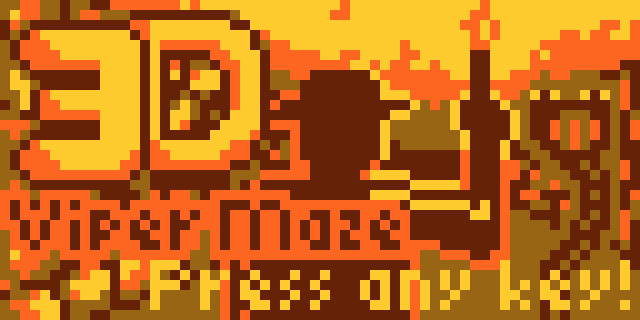

# 3D Viper Maze



A fun project for [Octojam 7](https://itch.io/jam/octojam-7). Challenge: write a
game for the illustrious Chip-8 platform in the month of October.

## The concept

3D Viper Maze is (obviously) an homage to the Sinclair ZX81 game [3D Monster
Maze](https://en.wikipedia.org/wiki/3D_Monster_Maze) from 1981. That game was
released just three years after the specification for Chip-8 was published, so
it's from around the same era. In honour of the first computer that ran Chip-8,
the Cosmac VIP, and its related magazine, the VIPer, I figured it was time for a
viper version of 3D Monster Maze. With a few twists of my own.

3D Viper Maze is not a game with an endless supply of randomly generated mazes,
like its namesake. Instead, it has handcrafted levels with vipers, coins and
buttons. Your challenge, if you accept it: to find the exit in each maze, while
collecting all the coins, in a series of ever more difficult puzzles.

## A big thanks to

* **[@JohnEarnest](https://github.com/JohnEarnest)** for quick answers to Octo
  related questions and fixing a `:org` bug in Octo 🐜
* **[@mirandavdende](https://github.com/mirandavdende)** for helping with level
  design and listening to me whining 😉
* **[@srekke](https://github.com/srekke)** for helping with musical inspiration
  🎶

## Development notes

### Toolchain

Of course I initially wanted to use [my own toolchain for
Chip-8](https://github.com/Timendus/chip-8), but unfortunately I wanted to
borrow a few instructions from both SuperChip and XO-Chip for this game. And my
toolchain does not support those yet. Adding those extensions now would take
away precious spare time from working on the actual game 😉 So I decided to work
with [Octo](https://johnearnest.github.io/Octo/) instead.

When the game got too large and too complicated for a single file, I wrote a
Bash script to recombine the files from the `src`, `data` and `screens`
directories in the right order. I thought about using the Octo command line mode
to assemble the result into a binary, but I figured pasting the un-assembled
code into the Octo editor and clicking "Run" was actually easier than having to
load the binary file. So the build script generates the
[`3dvipermaze.8o`](./3dvipermaze.8o) file and then just copies that to the
clipboard (on MacOS, at least).

Other than that I have made heavy use of [GIMP](https://www.gimp.org/) for all
of the pixel art.

### Keeping the pace

One of the things I hope to accomplish with this project
is to have (a version of) it run on the hardware from the period. Or as
I don't have the hardware: in an emulator. So when I started making this game I
thought: how can I keep this below, let's say, 30 cycles per frame and still run
smoothly?

The best way to quickly show full screens of bitmaps is to use the original low
resolution of 64x32 pixels, but use the SCHIP 16x16 sprites. This way you only
have to draw eight sprites to fill up the screen. The choice was quickly made to
have sprites with four colours, because with XO-Chip you basically get that for
"free", cycles-wise. Of course, this isn't really compatible with the original
Chip-8. So on pure Chip-8 I would have to draw 32 8x8 monochrome sprites to
achieve the same result. That will definitely be noticeable. But I really don't
mind to see the image build up on the screen, in fact I think it's nicely
nostalgic, as long as it's somewhat playable.

So this got me started. Eight 16x16 sprites results in four columns of two
sprites each, that I have to select the right images for. I only have to do the
calculations once per column, because the top and bottom images are somewhat
symmetrical. And I was thinking: if the calculations turn out to be the most
expensive part in the pure Chip-8 version, I can render a column of 8 times 8x8
sprites at once if I keep the same logic. If the rendering turns out to be the
slow bit, I can consider switching to eight columns instead of four so you get
more feedback during the rendering.

I was quite happy with my first implementation of the 16x16 rendering code, and
the binary decision trees that I implemented for finding the right sprites. It
purred along quite nicely at 20 or 30 cycles per frame.

That is, until I decided to add music and sound effects.

### Music to my ears

Doing music in XO-Chip is weird. You load a "sample" using the `audio` command,
that gets played 4000 times per second when the `buzzer` value is non-zero. But
since you can not read back the value of `buzzer`, you can't use that for
timing. You need to use the `delay` timer to know when to load the next note.
This means that playing music in your game "eats up" both the `buzzer` and
`delay` special registers, and I wanted to do more things in parallel that are
time sensitive. Also, since there's no such thing as interrupts in Chip-8, you have to continuously check in your main loop if the delay timer has run out yet, and adjust the buzzer accordingly.

The human ear is much less forgiving than the human eye. So to keep the audio
playing smoothly without any stuttering, I had to crank up the cycles per frame
to 100. I call the `clock-tick` routine that checks if we need to play the next
note yet in all loops that do anything with waiting for keypresses or creating
delays. I call it in between each rendered column. Otherwise it simply takes too
long between checks and you start to hear the stutter. But still, I had to go to
100 cycles per frame to get it to sound nice.

Because I wanted to do other time sensitive things "in parallel" I had to
implement software timers for different things. Sound is playing, text is
blinking, vipers are "thinking". Each of these is a virtual delay timer, which
gets updated by one real delay timer. Adding this meant I had to bump up the
cycles per frame even further.

But that's okay, I figured. The original Chip-8 spec doesn't have sound anyway,
so if I ever end up making a version for the hardware from the period I'll just
remove all the magic that has to do with sound and we'll be fine.

In the end, I'm quite happy with the music routines I wrote. They seem pretty
robust now, and allow you to play a "background score" and interject short
little jingles as sound effects. I'm pretty pleased with that, and I think it
really adds to the overall game vibe. If you'd like to use my code, [feel free
to take a peak](./music.8o) at the stand-alone version of it.

### Pointing down

Octo can't reference labels that haven't been defined yet in macros. You can do
these things:

```octo
  jump label-below
  label-below            # this is a 'call'
  i := label-below       # 12-bit load into index register
  i := long label-below  # 16-bit load into index register
  :unpack 0 label-below  # 12-bit load into v0-v1 registers

: label-below
```

But you can't do these things:

```octo
:macro pointer ADDRESS {
  :byte { ADDRESS >> 8 }
  :byte { ADDRESS }
}

:macro unpack-long ADDR {
  :calc hi { 0xFF & ADDR >> 8 }
  :calc lo { 0xFF & ADDR }
  v0 := hi
  v1 := lo
}

  pointer label-below      # 16-bit 'put address in RAM here'
  unpack-long label-below  # 16-bit load into v0-v1 registers

: label-below
```

This is a very understandable limitation, but also a pretty annoying one. Mainly
because in my game I have maps with triggers. You walk somewhere specific in the
game and something happens. So my maps use pointers to point to subroutines that
make the "something" happen. But one of the things that often needs to happen is
to switch to a new map when you hit the finish. At first I used these trigger
routines to define which map should come next, so some trigger routines would
reference maps too. Creating a cyclic reference, in a world that can only point
up to things it's already seen.

At first I solved this by using `pointer trigger-routine` in my map definitions
to put the address of the relevant trigger subroutine in RAM. And the trigger
routines then loaded a new map by using `:unpack 0 new-map` before calling a map
loading routine. Sure, this works, but the native `:unpack` only supports 12-bit
addresses. We need a macro like `unpack-long` to be able to address places in
memory above 3.5K. But that can't do forward references, because it's a macro.

So for a while I feared that my map definitions would have to live in executable
code space, severely limiting either the amount of code or the number of maps
the game can have. However, when implementing the stats screen where you can
choose to go on to the next level or return to the previous one, I realised that
it would be much easier to use a `pointer next-map` in the meta-data of the
current map. This way I did not have to juggle with pointers to maps in the code
that handles this screen, and it solved my 12-bit limit almost as a by-product.

The only downside is that my maps are now in memory in reverse order, each one
referencing back up to the next. I guess arbitrary limitations really do make us
creative 😉

### So many bitmaps

One of the things that surprised me was just how many bitmaps I had to draw,
import and pick the right ones from at the right times to achieve the faux 3D
effect. My first instinct was to draw 8-pixel wide columns that each represent a
hallway at a specific depth. So we could have four depths (four columns on the
left, four on the right). But looking at 3D Monster Maze and trying out
different drawings, I realised that this would look incredibly bad.

In real life, things get smaller as they get further away. So the same segment
of wall should look much less wide at a distance than close up.

Trying out different drawings I realised that six levels of depth looked best,
each getting smaller and smaller as they disappeared into the distance. But
having six levels that all look different also means I could not re-use drawings
for different depths and that there are a hell of a lot of permutations. Even when the engine and the drawings were well under way, I would still find
edge cases that I hadn't yet drawn an image for.

To make all of this easier for myself, I set up two systems that I'm pretty
happy with.

First, I gave up messing with bytes after a couple of minutes and started
drawing actual images. I have a script that cuts up PNG files in 16x16 sprites
and converts them to text files in a format that Octo understands. It does this
using ImageMagick and some Bash magic. If the image hasn't changed, the text
file doesn't get updated. After that, I have a script that takes all the text
files with image data and combines them into one big file. These scripts have
become part of my build pipeline. So if I edit an image, I just have to rebuild
the project and the image gets cut up, converted, combined and included into the
program. So much luxury for just a few simple Bash scripts!

The second thing I did was to not try to hard-code the decisions that needed to
be made to select the right image. Again, I started with the naive approach of
having a bunch of nested `if`s, and quickly realised that this was not going to
scale. So I came up with a data structure that defines those decisions, and a
few macros to make it more legible:

```octo
: nodes-column-one
#        X Y  no wall   wall
  coord -1 0  c1node 3  c1node 1   # node 0
  coord  0 1  c1node 2  c1leaf 3   # node 1
  coord -1 1  c1node 9  c1leaf 0   # node 2
  coord  0 1  c1leaf 1  c1node 4   # node 3
  coord -1 1  c1node 5  c1leaf 4   # node 4
  # Et cetera
```

This is the start of the decision tree for the left-most column of 16 pixels.
The data structure tells us that the first thing we'll look at is the spot to
the left of the player (the player is at coordinate 0,0). If there's a wall
there, we go to the next node in the list. If there's no wall there, we go to
the fourth node in the list (`node 3`). Until finally we hit a leaf in the tree,
which is a pointer to one of the images, in a long list of images:

```octo
: leafs

  # Column 1
  pointer hall-0+0+0      # leaf 0
  pointer hall-1+0+0      # leaf 1
  pointer hall-2+0+0      # leaf 2
  pointer wall-1+0+0      # leaf 3
  # Et cetera
```

This allowed me to keep track of things, without going too insane. Adding new
images and new decision paths is relatively easy to do. At least a lot easier
than it would have been to change hard-coded `if` statements. And if the time
ever does comes that we really do need the speed boost, I'm sure we could
generate those statements from these trees.

## Rough TO DO list:

* [x] Have in-memory models of a map and the player's position
* [x] Render model of map as a top-down "minimap" (for debugging and fun)
* [x] Handle keypresses and update player model accordingly
* [x] Write a convert tool to go from images to binary data that Octo understands
* [x] Artwork
  * [x] Draw a gazillion images of "3D" walls
  * [x] Make the gazillion images prettier
* [x] 'Sprite' the right images to the screen depending on position and map
  * [x] Column one
  * [x] Column two
  * [x] Column three
  * [x] Column four
  * [x] Bugfix S-bends in the hallway
* [x] Allow switching between 3D view and minimap view
* [x] Add vipers that kill you and send you back to start
* [x] Add buttons that change walls
* [x] Add music
* [ ] Coding
  * [x] Fancy viper animation
  * [x] Vipers that randomly attack you from a distance
  * [x] Add text routine for some extra feedback
    * Button: "Something has changed!"
    * Viper near: "You hear slithering"
  * [x] Add introduction text
  * [x] Add stats screen after each level
* [ ] Pixel art
  * [x] Title screen
  * [x] Victory screen for map
  * [ ] Victory screen for game
* [ ] Music
  * [ ] A title song
  * [ ] One or two more songs for levels
* [ ] Content
  * [ ] More levels!
* [ ] Bonus challenge: make a regular CHIP-8 game out of this?
